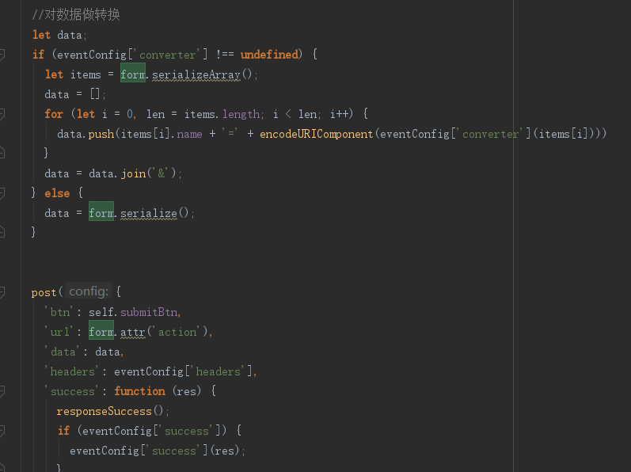
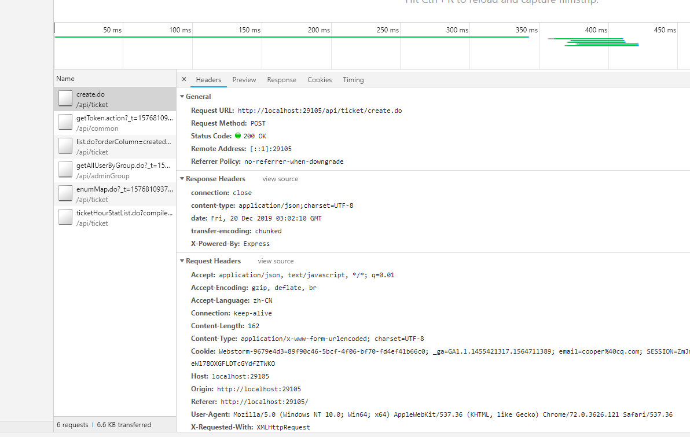
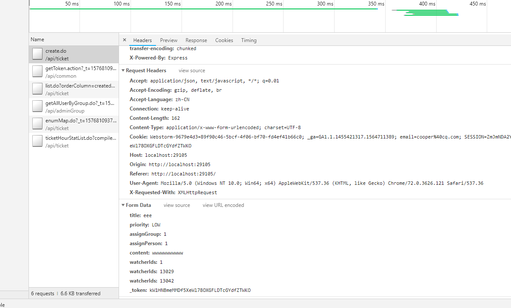
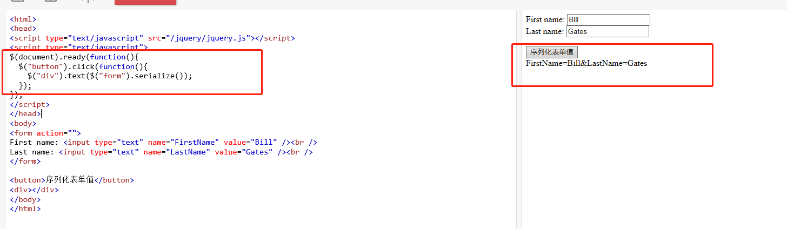

# **学习loading。。。**
## 1.action是什么？
Action 是一个普通 javascript对象，它是改变 State 的唯一途径，来源于用户与views的交互行为，改变state

## 2.Dispatcher是什么？
提供了把Action分发给Store的机制，dispatcher根据action type调用对应的回调函数，dipatch 可以看作是触发action行为的方式，而 Reducer 则是描述如何改变数据的

## 3.单页面应用的好处？
页面片段局部刷新，用户体验更好，尤其是移动设备上，开发难度比多页面应用高点（需要专门的框架来降低难度），页面资源共享比较容易、（不像多页面应用，依赖localStorage，url，cookie等实现麻烦）,单页面应用已经是web开发的潮流

## 4.git的tag作用？
使用git 创建一个tag ,这样一个“不可修改”的历史代码版本就像被我们封存起来一样,不论是运维发布拉取,或者以后的代码版本管理,都是十分方便的，这和分支不一样
## 5.promise对象？
直白来讲，Promise就是一种对执行结果不确定的一种预先定义，如果成功，就xxxx；如果失败，就xxxx，就像事先给出了一些承诺。他的思想是每一个异步任务返回一个Promise对象，该对象有个then方法，允许指定回调函数
               比如，f1的回调函数f2,可以写成：f1().then(f2);

                function f1(){

                　　　　var dfd = $.Deferred();

                　　　　setTimeout(function () {

                　　　　　　// f1的任务代码

                　　　　　　dfd.resolve();

                　　　　}, 500);

                　　　　return dfd.promise;

                　　}
 ## 6.componentDidUpdate？
 组件更新结束之后执行，在初始化render时不执行
## 7.nodejs升级1.安装nvm
## 8.react路由：
    （1）react路由用的switch,switch是用于判断在Route里面设置的地址，进入子页面使用
    （2）Link点击的路由地址，跳转到页面上Route组件的位置
## 9.HTTP与HTTPS的区别：
超文本传输协议HTTP协议被用于在Web浏览器和网站服务器之间传递信息，HTTP协议以明文方式发送内容，不提供任何方式的数据加密，如果攻击者截取了Web浏览器和网站服务器之间的传输报文，就可以直接读懂其中的信息，因此，HTTP协议不适合传输一些敏感信息。  
为了解决HTTP协议的这一缺陷，需要使用另一种协议：安全套接字层超文本传输协议HTTPS，为了数据传输的安全，HTTPS在HTTP的基础上加入了SSL协议，SSL依靠证书来验证服务器的身份，并为浏览器和服务器之间的通信加密。  
HTTPS和HTTP的区别主要如下：

　　1、https协议需要到ca申请证书，一般免费证书较少，因而需要一定费用。

　　2、http是超文本传输协议，信息是明文传输，https则是具有安全性的ssl加密传输协议。

　　3、http和https使用的是完全不同的连接方式，用的端口也不一样，前者是80，后者是443。

　　4、http的连接很简单，是无状态的；HTTPS协议是由SSL+HTTP协议构建的可进行加密传输、身份认证的网络协议，比http协议安全。
## 10.webpack 里的chunk是什么意思？  
指的打包后的代码块的意思，chunkname就是打包后代码的名字。  
## 11.http学习？  [详细参考地址](https://blog.csdn.net/qq_16546829/article/details/81165220)
首先要知道计算机网络的分层，大致两种分法  
 七层：物理层、链路层、网络层、传输层 、==会话层、表示层==、应用层   
 五层：物理层、链路层、网络层、传输层、 ----- 应用层  

### 物理层（“实体层”）
“实体层”，它就是把电脑连接起来的物理手段。它主要规定了网络的一些电气特性，作用是负责传送0和1的电信号。
### 链路层
1.链路层有个mac地址：  
以太网规定，连入网络的所有设备，都必须具有"网卡"接口。 数据包必须是从一块网卡，传送到另一块网卡。网卡的地址，就是数据包的发送地址和接收地址，这叫做MAC地址。每块网卡出厂的时候，都有一个全世界独一无二的MAC地址，长度是48个二进制位，通常用12个十六进制数表示前6个十六进制数是厂商编号，后6个是该厂商的网卡流水号。有了MAC地址，就可以定位网卡和数据包的路径了。  

2.使用“广播”的方式发送数据包    
"网络层"出现以后，每台计算机有了两种地址，一种是MAC地址，另一种是网络地址。两种地址之间没有任何联系，MAC地址是绑定在网卡上的，网络地址则是管理员分配的，它们只是随机组合在一起。网络地址帮助我们确定计算机所在的子网络，MAC地址则将数据包送到该子网络中的目标网卡。因此，从逻辑上可以推断，必定是先处理网络地址，然后再处理MAC地址。  

### 网络层
我们用分成四段的十进制数表示IP地址，从0.0.0.0一直到255.255.255.255。互联网上的每一台计算机，都会分配到一个IP地址。这个地址分成两个部分，前一部分代表网络，后一部分代表主机。但是，问题在于单单从IP地址，我们无法判断网络部分。这就要用到另一个参数"子网掩码"（subnet mask）。知道"子网掩码"，我们就能判断，任意两个IP地址是否处在同一个子网络。


### 传输层
"传输层"的功能，就是建立"端口到端口"的通信。

## HTTP协议中的短轮询、长轮询、长连接和短连接 [参考教程](http://web.jobbole.com/85541/)
HTTP协议是基于请求/响应模式的，因此只要服务端给了响应，本次HTTP连接就结束了，根本没有长连接短连接这一说。TCP连接是一个双向的通道，它是可以保持一段时间不关闭的，因此TCP连接才有真正的长连接和短连接这一说。长连接是指的TCP连接，而不是HTTP连接。  
### 第一个问题是，是不是只要设置Connection为keep-alive就算是长连接了？  
当然是的，但要服务器和客户端都设置。  
### 第二个问题是，我们平时用的是不是长连接？  
这个也毫无疑问，当然是的。（现在用的基本上都是HTTP1.1协议，你观察一下就会发现，基本上Connection都是keep-alive。而且HTTP协议文档上也提到了，HTTP1.1默认是长连接，也就是默认Connection的值就是keep-alive）  
长连接是为了复用，那既然长连接是指的TCP连接，也就是说复用的是TCP连接。【TCP协议能够确保数据不会遗失。它的缺点是过程复杂、实现困难、消耗较多的资源。】这里节省了tcp消耗
### 长短轮询和长短连接的区别
第一个区别是决定的方式，一个TCP连接是否为长连接，是通过设置HTTP的Connection Header来决定的，而且是需要两边都设置才有效。而一种轮询方式是否为长轮询，是根据服务端的处理方式来决定的，与客户端没有关系。  
第二个区别就是实现的方式，连接的长短是通过协议来规定和实现的。而轮询的长短，是服务器通过编程的方式手动挂起请求来实现的。 
## WebSocket 是什么？ [参考教程](https://www.cnblogs.com/jingmoxukong/p/7755643.html)
了解计算机网络协议的人，应该都知道：HTTP 协议是一种无状态的、无连接的、单向的应用层协议。它采用了请求/响应模型。通信请求只能由客户端发起，服务端对请求做出应答处理。  

这种通信模型有一个弊端：HTTP 协议无法实现服务器主动向客户端发起消息。  

WebSocket 就是这样发明的。WebSocket 连接允许客户端和服务器之间进行全双工通信，以便任一方都可以通过建立的连接将数据推送到另一端。WebSocket 只需要建立一次连接，就可以一直保持连接状态。这相比于轮询方式的不停建立连接显然效率要大大提高。
## react高阶组件？ [参考教程](https://segmentfault.com/a/1190000010371752)
高阶函数可以接受一个函数作为参数，返回值作为也是函数的函数。类似的 高阶组件也可以接受一个组件为参数，返回一个被加工过的组件。 

下面我们来实现一个最简单的高阶组件（函数），它接受一个React组件，包裹后然后返回
```
export default function withHeader(WrappedComponent) {
  return class HOC extends Component {
    render() {
      return <div>
        <div className="demo-header">
          我是标题
        </div>
        <WrappedComponent {...this.props}/>
      </div>
    }
  }
}


```
在其他组件里，我们引用这个高阶组件，用来强化它。
```
@withHeader
export default class Demo extends Component {
  render() {
    return (
      <div>
        我是一个普通组件
      </div>
    );
  }
}
```
## nvm？ [参考教程](https://www.jianshu.com/p/d0e0935b150a)
我们可能同时在进行2个项目，而2个不同的项目所使用的node版本又是不一样的，或者是要用更新的node版本进行试验和学习。这种情况下，对于维护多个版本的node将会是一件非常麻烦的事情，而nvm就是为解决这个问题而产生的，他可以方便的在同一台设备上进行 ***多个node版本之间切换***

## 关于nodejs [参考教程](https://www.cnblogs.com/snandy/p/3445550.html)
1.载入node_modules里的模块，用var mod = require('module_name')方式，如果模块名不是路径，也不是内置模块，Node将试图去当前目录的node_modules文件夹里搜索。如果当前目录的node_modules里没有找到，Node会从父目录的node_modules里搜索，这样递归下去直到根目录。

2.载入文件目录模块，可以直接require一个目录，假设有一个目录名为folder，如
var myMod = require('./folder')
此时，Node将搜索整个folder目录，Node会假设folder为一个包并试图找到包定义文件package.json。如果folder目录里没有包含package.json文件，Node会假设默认主文件为index.js，即会加载index.js。如果index.js也不存在，那么加载将失败。

## 关于异步处理，ES5的回调,ES6的Promise，ES7的async-await
1.ES6 promise详解 [参考教程](https://www.cnblogs.com/whybxy/p/7645578.html)  
  需要注意的是**链式操作的用法，all的用法，race的用法**
  ```
  // 和回调不同的是，这里可以直接使用链式调用
  runAsync1()
  .then(function(data){
      console.log(data);
      return runAsync2();
  })
  .then(function(data){
      console.log(data);
      return '直接返回数据';  //这里直接返回数据
  })
  .then(function(data){
      console.log(data);
  });
  
  
  // all方法并行执行异步操作的能力，原理是「谁跑的慢，以谁为准执行回调」
  Promise
  .all([runAsync1(), runAsync2(), runAsync3()])
  .then(function(results){
      console.log(results);
  });

  //  race方法与all相对，「谁跑的快，以谁为准执行回调」
  Promise
  .race([runAsync1(), runAsync2(), runAsync3()])
  .then(function(results){
      console.log(results);
  });
  ```
  2.ES7 async await [参考教程](https://segmentfault.com/a/1190000011526612?utm_source=tag-newest)  
   (1) async用来表示函数是异步的，定义的函数会返回一个promise对象，可以使用then方法添加回调函数。  
   (2) await 可以理解为是 async wait 的简写。await 必须出现在 async 函数内部，不能单独使用。  
   (3) 如果await的是 promise对象会造成异步函数停止执行并且等待 promise 的解决,如果等的是正常的表达式则立即执行  
   关于await的并行串行 [参考教程](https://www.cnblogs.com/leungUwah/p/7932912.html)
   
   ## 关于axios
   ### 1.axios里的baseURL和webpack里的 proxyTable有什么区别。
   这个用途不一样，
baseUrl会附加到你绑定的axios实例（如果是全局的，那就是所有实例）上，即如果get/post的url参数是相对路径（如） /api/c/xx，那就会执行 baseUrl + '/api/c/xx',如果未指定baseUrl，那就走浏览器地址栏里的base + baseUrl。
webpack里的proxyTable是测试环境为了避免浏览器下的跨域访问，而以nodejs代理成同前端页面（即浏览器地址栏）同域的一种处理。指定proxyTable后， axios就不需要指定baseUrl了。proxyTable会把base + '/api/c/xx'代理到【base baseUrl + '/api/c/xx'】的接口地址上。
当然工程发布时，后端和前端也需要发布到同一个域下。

## 关于es6语法
### Symbol 这是一种新的基础数据类型，它的功能类似于一种标识唯一性的ID
```
let s1 = Symbol()
let s2 = Symbol('another symbol')
let s3 = Symbol('another symbol')

s1 === s2 // false
s2 === s3 // false
```
### Set 类似数组，成员唯一，使用set去重 [...new Set(arr)] ，for .. of..遍历新的数据类型
```
var s=new Set([2,3,3,5])
s.add(4) // Set(4) {2, 3, 5, 4}

s.has(3) // true

s.delete(2) // true s变为Set(3) {3, 5, 4}

s.size // 3

s.clear() // 清空 Set(0) {}

// 循环遍历集合 for.. of.. 只能输出值
for(var val of s){
console.log('值',val)  // 值 xxx
}

```
### Map 类似对象，但键不限于字符串（传统对象，健值一定为字符串）
```
var a=new Map()

// a.set('健','值') 新增值
a.set('a',1111) // Map(1) {"a" => 1111}

// a.get('键') 获取值
a.get('a') // 1111

// 当键值为对象时，注意：对象不能直接写，需要赋值给变量才行

// bad
a.set(['dd'],1111)
a.get(['dd']) // undefined

// good
var dd=['dd']
a.set(dd,1111)
a.get(dd)

// a.keys() 获取所有的键值
// a.values() 获取所有的value值
```
### repeat函数：平铺指定次数 如 'x'.repeat(3) // xxx
```
var a='abs'
console.log(a.repeat(3))  // absabsabs
```

### module ：import export必须走http协议

## 针对登陆时 session，cookie，token的理解
```
session id （区分用户）-》token（令牌） 登陆时发给用户token，存储在客户端，当客户端发送其他请求时，将userId和token一起带过来,服务器这边将userid再加密和token比较，相等则登陆过了

session是存储服务器端，cookie是存储在客户端，所以session的安全性比cookie高。

当浏览器关闭的时候会话cookie消失，所以sessionid也就消失了，但是session的信息还存在服务器端，只是查不到所谓的session但它并不是不存在。


存储session信心到服务端会加重服务器的负担，而且遇到服务端使用负载均衡还有问题，后来有了token，将信息存储在客户端，服务器每次获取到token再使用自己的加密方式解密


使用基于 Token 的身份验证方法，在服务端不需要存储用户的登录记录。大概的流程是这样的：
客户端使用用户名跟密码请求登录
服务端收到请求，去验证用户名与密码
验证成功后，服务端会签发一个 Token，再把这个 Token 发送给客户端
客户端收到 Token 以后可以把它存储起来，比如放在 Cookie 里或者数据库里
客户端每次向服务端请求资源的时候需要带着服务端签发的 Token
服务端收到请求，然后去验证客户端请求里面带着的 Token，如果验证成功，就向客户端返回请求的数据
```
### 使用axios时，post提交注意设置headers为Content-Type: application/x-www-form-urlencoded
```

/**
 *  提交JSON格式的网络请求
 *  @config 其他配置
 */
export function $httpPOST ({ url, data = {}, config = {
    headers: {'Content-Type': 'application/x-www-form-urlencoded;charset=utf-8'},
    transformRequest: [function (data) {
      data = qs.stringify(data)  // 这里需要使用qs模块序列化一下
      return data
    }]
  }}) {
  //   headers: {'Content-Type': 'application/json;charset=utf-8'},
  // return new Promise((resolve, reject) => {
  //   Axios.post(url, data, config)
  //     .then(response => {
  //       resolve(response.data)
  //     })
  // })
  return Axios.post(url, data, config)
}

```

## 关于文件上传
### 1.当图片较少时可以考虑直接转为base64存储在数据库
### 2.图片比较大时上传至文件服务器，并返回路径 [参考网址](https://blog.csdn.net/weixin_44135121/article/details/91049103)
```
<!doctype html>
<html lang="en">
<head>
    <meta charset="UTF-8">
    <meta name="viewport"
          content="width=device-width, user-scalable=no, initial-scale=1.0, maximum-scale=1.0, minimum-scale=1.0">
    <meta http-equiv="X-UA-Compatible" content="ie=edge">
    <title>图片上传到服务器</title>
    <script src="jquery.min.js"></script>
</head>
<body>
<input type="file" id="file" name="imgFile" accept="image/jpeg,image/jpg,image/png">

</body>
<script>
    $('#file').change(function () {
        var input = $('#file')[0];
        //图片上传成功后会将图片名称赋值给 value 属性
        if (input.value) {
            //使用 FormData 对象 
            // FormData类型其实是在XMLHttpRequest 2级定义的，它是为序列化表以及创建与表单格式相同的数据（当然是用于XHR传输）提供便利。
            var formData = new FormData();
            //将图片对象添加到 files
            formData.append('files', $('#file')[0].files[0])
            //使用 ajax 上传图片
            $.ajax({
                url: 'http://localhost:8081/file_upload',
                type: 'POST',
                cache: false,
                data: formData,
                processData: false,
                contentType: false
            }).done(function (res) {
                console.log(res);
            }).fail(function (res) {
                console.log(res);
            });
            //以下是将图片显示到 img 标签上
           var pic = input.files[0];
           var read = new FileReader();
           read.readAsDataURL(pic); // readAsDataURL方法会使用base-64进行编码
           read.onload = function (e) { // 编码后的结果显示到img里
              document.getElementById('img').src = e.target.result;
           };
        }
    })
</script>
</html>

```
### 表单提交
想要使用name键值对传递多个名称相同的字段，如name:1,name:2,name:3等，使用js对象由于键值对不同，前面的name会被覆盖，最终只能是name:3。遇到这种情况只能使用表单提交

#### 1.使用jq的serialize方法序列化参数 [参考网址](https://www.cnblogs.com/lijianda/p/8867555.html)


## 关于readAsDataURL方法[参考链接](https://blog.csdn.net/sinat_31057219/article/details/70242265)

## RBAC权限管理模型-（Role-Based Access Control）——基于角色的访问控制 [参考网址](https://www.xiaoman.cn/detail/150)

## 关于md5加密 [参考教程](https://www.cnblogs.com/second-tomorrow/p/9129043.html)
### 首先，MD5加密后是不可逆的，最常见的应用场景就是登陆是的密码，数据库里面存储的是利用md5加密后的密文，当客户端接受到用户输入的密码时，与后端字符串按照之前的规则和某个字符串拼接，经过MD5加密后再与数据库的密文对比是否一致，相等则密码正确。这样的设计还有另外一个好处，就是可以一定程度上防止SQL注入

## 公钥密钥 [参考网址](https://www.cnblogs.com/hzk001/p/11744028.html)

## 1. 问：package.json里面的browserslist 和.postcssrc.js里面的autoprefixer？browserslist对象智能添加css前缀，autoprefixer也是添加前缀，两个的区别？还要为什么会用一起用到

答案：package.json里面的browserslist试着创造一个设定档可以用來給你想像得到的工具都引來使用，其他工具会使用browserslist中的配置进行参考,如智能添加css前缀autoprefixer插件会参考里面的配置处理，当然不参考也没什么，这取决于插件的开发者。[browserslist参考](https://www.cnblogs.com/both-eyes/p/10151272.html)
## 2. 问vue中几个文件的作用
  1、.postcssrc.js [参考1](https://www.jianshu.com/p/71b8f1caef4e)[参考2](https://github.com/michael-ciniawsky/postcss-load-config)

       众所周知为兼容所有浏览器，有的CSS属性需要对不同的浏览器加上前缀，然而有时添加一条属性，需要添加3~4条类似的   属性只是为了满足浏览器的兼容，这不仅会增加许多的工作量，还会使得你的思路被打断。  如何解决这个问题? 处理CSS前       缀问题的神器——AutoPrefixer。

     Autoprefixer是一个后处理程序，你可以同Sass，Stylus或LESS等预处理器共通使用。它适用于普通的CSS，而你无需关心要 为哪些浏览器加前缀，只需全新关注于实现，并使用W3C最新的规范。

2、.eslintrc.js
 eslint是用来管理和检测js代码风格的工具，可以和编辑器搭配使用，如vscode的eslint插件 当有不符合配置文件内容的代码出现就会报错或者警告

3、.babelrc [参考](https://www.cnblogs.com/tugenhua0707/p/9452471.html)
这个文件是用来设置转码的规则和插件的


## 关于适配
postcss-pxtorem 支持排除以某个字符开始的样式。，如 el-，使用        selectorBlackList  : ['weui','mu'], // 忽略转换正则匹配项
px2rem-loader 不支持排除文件

postcss-px2rem-exclude和px2rem-exclude两个插件目前能转换本项目文件，但是element ui样式完全没转换

## 在写婚礼邀请函时看到一段css布局代码，关于height:10%的使用
全屏轮播时，父级别设置height:100%;子级别设置height:10%可以实现子集铺满。
如果子级使用的是height:100%，那么将会是所有子集加起来的高度，而不是一屏幕的高度。

## 英文汉字等按字母排序
```
  // 国际化相关
  /**
   *  根据字母汉字等排序
   *  @arr 将数组排序
   * */
  Vue.prototype.$localeCompare = function (arr) {
    let lang = window.i18n.locale // 当前语言类型
    if (lang.toLowerCase().indexOf('zh') > -1) { // 中文
      arr.sort(
        function compareFunction (a, b) {
          return a.localeCompare(b, 'zh')
        }
      )
    } else { // 英文等
      arr.sort(function (a, b) {
        return a.localeCompare(b)
      })
    }
    return arr
  }
```
## 关于图片压缩，采用canvas压缩，[参考地址](https://www.jianshu.com/p/f46195810c3b)
原理大概就是：
```
1、先将图片的file文件转成baseURL
2、创建一个image标签去接收文件获取图片的宽高和比例。
3、创建canvas画布设置画布的大小。
4、将图片绘制到canvas上面。
5、对canvas进行压缩处理，获得新的baseURL  (这一步可以看作是将原图进行了压缩)
6、将baseURL转化回文件。（返回压缩后的图片）

// 图片压缩相关的公共方法
  /**
   * canvas压缩图片
   * @param {图片路径} obj.path 图片路径base64
   * @param {输出图片宽度} obj.width 等比缩放不用传宽度高度
   * @param {输出图片名称} obj.fileName 不传初始赋值image
   * @param {压缩图片程度} obj.quality 不传初始赋值0.8。值范围0~1
   * @param {压缩图片的类型} obj.type image/jpeg || image/png
   * @param {期望压缩图片的大小(单位kb)} obj.targetSize （最多压缩次数压缩后都比期望尺寸大则弹出错误）
   * @param {回调函数} callback
   */
  Vue.prototype.$pressImg = function (obj, callbackFn) {
    if (!obj.path) {
      callbackFn('')
      return true
    }
    if (obj.targetSize && this.$dataURLtoFile(obj.path, 'img').size / 1024 < obj.targetSize) { // 当前图片小于目标压缩大小，直接返回
      callbackFn(obj.path) // base64
      return true
    }
    let curNum = 1 // 当前压缩次数
    let maxNum = 5 // 最多压缩次数
    let self = this
    let img = new Image()
    img.src = obj.path
    img.onload = function () {
      let canvas = document.createElement('canvas')// 创建canvas元素
      let width = img.width // 确保canvas的尺寸和图片一样
      let height = img.height
      let type = obj.type ? obj.type : 'image/jpeg'
      let quality = obj.quality ? obj.quality : 0.8
      canvas.width = obj.width ? obj.width : width
      canvas.height = obj.height ? obj.height : height
      canvas.getContext('2d').drawImage(img, 0, 0, width, height) // 将图片绘制到canvas中
      let press = function () {
        return canvas.toDataURL(type, quality) // 转换图片为dataURL
      }
      let base64 = press()
      if (obj.targetSize) { // 有大小限制则递归压缩
        while (self.$dataURLtoFile(base64, 'img').size / 1024 > obj.targetSize) {
          console.log('图片压缩次数', curNum)
          console.log('压缩后的图片大小', self.$dataURLtoFile(base64, 'img').size / 1024)
          if (curNum === maxNum) { // 达到最大压缩次数
            base64 = 'large' // 图片过大，请重新上传
            break
          }
          curNum++
          // 递归压缩发现到后面图片大小基本不变，这里采用更简单的方法更改压缩质量
          quality = quality / 2
          base64 = press()
        }
      }
      callbackFn && callbackFn(base64)
      return true
    }
    img.onerror = function () {
      callbackFn && callbackFn('err')
      return false
    }
  }

  /**
   * 将base64转换为文件流
   * @param {baseURL} dataurl
   * @param {文件名称} filename
   * @return {文件二进制流} 文件大小单位是b
   */
  Vue.prototype.$dataURLtoFile = function (dataurl, filename) {
    let arr = dataurl.split(',')
    let mime = arr[0].match(/:(.*?);/)[1]
    let bstr = atob(arr[1])
    let n = bstr.length
    let u8arr = new Uint8Array(n)
    while (n--) {
      u8arr[n] = bstr.charCodeAt(n)
    }
    return new File([u8arr], filename, {type: mime}) // 转文件流
    // return new Blob([u8arr], {type: mime}); // 转blob
    
    // 其他对file的处理
     // var blob = new Blob(buffer, {type: ''}); // buffer转blob
   //   return new File([blob], 'msr-' + (new Date).toISOString().replace(/:|\./g, '-') + '.mp4', {  // blob转file
    //      type: 'video/mp4',
    //  });
  }

  /**
   * 将file文件转化为base64
   * @param {二进制文件流} file
   * @param {回调函数，返回base64} fn
   */
  Vue.prototype.$changeFileToBaseURL = function (file, fn) {
    // 创建读取文件对象
    let fileReader = new FileReader()
    // 如果file没定义返回null
    if (file === undefined) return fn(null)
    // 读取file文件,得到的结果为base64位
    fileReader.readAsDataURL(file)
    fileReader.onload = function () {
      // 把读取到的base64
      let imgBase64Data = this.result
      fn(imgBase64Data)
    }
  }
  
  。。。。。。。。。
  。。。。。。。
  // 在plus中的调用
        /**
       *  上传文件（base64）
       * */
      uploadBase64 () {
        let self = this
        let path = this.picture
        let wt = plus.nativeUI.showWaiting() // 显示原生loading
        // 根据路径读取到文件
        plus.io.resolveLocalFileSystemURL(path, function (entry) {
          entry.file(function (file) {
            let fileReader = new plus.io.FileReader()
            fileReader.readAsDataURL(file)
            fileReader.onloadend = function (e) {
              self.$pressImg({
                path: e.target.result,
                targetSize: 1024 // 不超过1024kb
              }, (base64) => {
                wt.close()
                if (base64 === 'large') {
                  self.showAlert(self.$t('register.ScanUpload.pLarge'))
                } else if (!base64) {
                  self.showAlert(self.$t('register.ScanUpload.pErr'))
                } else {
                  // let filename = f.replace(f.substring(0, f.lastIndexOf('/') + 1), '')
                  // let param = {
                  //   fileName: filename,
                  //   dataInput: e.target.result.toString()
                  // }
                  //               identityType选择项：PASSPORT(1),IDENTITY_CARD(2)
                  // 上传
                  self.$httpPOST({
                    url: self.$xhrConfig.setting.identityUpload,
                    data: {
                      mobile: self.mobile,
                      identityType: self.identityType,
                      images: self.$base64Img(base64)
                    }
                  }).then((res) => {
                    if (res.sus) {
                      self.showAlert(self.$t('register.ScanUpload.upSus'))
                      self.goBack()
                    }
                  }).catch((error) => {
                    self.showAlert(self.$t('register.ScanUpload.upFail'))
                    console.log(error)
                  })
                }
              })
            }

            fileReader.onerror = function () {
              self.showAlert(self.$t('register.ScanUpload.msg'))
            }
          })
        })
      },
  。。。。。。。
  。。。。。。。。。
```
## 单点登陆流程[参考网站](https://blog.csdn.net/xiaoguan_liu/article/details/91492110)
### 1.首先搞懂单系统登陆的流程？（闪汇后端的请求的token不一样，这个用来做重复性提交认证，后端对session还做了终端ip记录，所以不用担心session被拦截）
sessionid   
首先用户输入用户名密码请求后端服务器，成功则分配一个sessionid返回，并存储在浏览器，同时记录当前sessonid未已登录或者已授权。后续浏览器访问资源时，
每次请求受保护资源时都会检查会话对象中的登录状态，只有 isLogin=true 的会话才能访问，登录机制因此而实现。  
token  
登陆后存储在浏览器，后续发送请求时传递到后端

## 关于页面打印（有css控制打印时去掉某些样式，有分页代码）
window.print()打印全屏，要想只打印某个区域使用iframe加载css和html  
打印插件，  （大概原理，将所选html片段提取出来，放入iframe，并调用iframe中的window.print()方法）  
jquery jqprint  （最终选择使用这个，但是css和js得提前在html中声明）  
vue vue-print-nb  （在使用过程中不兼容ie。。。）  

## 关于离开页面前的判断 js onbeforeunload 事件，比如提示用户保存编辑了的数据
```
//注意： 谷歌浏览器操作了才提示，不能使用console，alert，prompt
//现在浏览器为了优化用户体验，对onbeforeunload 的离开页面提示做出了限制。
//比如最新版的谷歌浏览器，必须要有用户在页面上有点击等操作之后再离开页面才能有提示，如果页面打开后没有用户在页面上点击等操作就离开（关闭）页面就不会有提示。
//另外一般的ide或代码编辑器内嵌浏览器离开（关闭）页面也不会有提示

window.onbeforeunload = function (e) { 
e = e || window.event; 
// For IE and Firefox prior to version 4 
if (e) { 
e.returnValue = '确定退出吗？'; 
} 

// For Safari 
return '确定退出吗？'; 
}; 
```
## webpack 进阶，compiler和compilation讲解
### 
### 

## 中高级前端知识点，面试复习：

### 箭头函数和普通函数的区别？
箭头函数没有arguments参数，无法作为构造函数，不能被new，this取决于上下文，本身没有this，使用call，apply等无法改变this指向，
普通函数都可以，其中普通函数的this指向调用方

### 节流和防抖？
节流：对于短时间连续触发的事件，防抖的含义是在某段时间内这样的事件只触发一次，从而节约性能（场景：如滚动，resize）【实现：使用timeout并清除，如echarts resize的操作】  
防抖：如果短时间内大量触发同一事件，那么在函数执行一次之后，该函数在指定的时间期限内不再工作，直至过了这段时间才重新生效（场景：搜索框input事件，例如要支持输入实时搜索可以使用节流方案（间隔一段时间就必须查询相关内容），或者实现输入间隔大于某个值（如500ms），就当做用户输入完成，然后开始搜索，具体使用哪种方案要看业务需求）【实现：定义一个开关和timeout混合使用】  
节流和防抖的区别就是：节流只触发最后一次，防抖每隔一段时间后必定触发  
共同点：都是控制事件触发频率的方法，用于优化性能  

### 页面渲染过程？

1.在Dom树解析的过程中，遇到link会去进行请求资源，这个过程不会阻塞Dom的解析；  
2.遇到script标签，则会将解析停下来，去执行js代码，因此script标签通常建议放在</body>之前，能优化用户体验，减少白屏时间，还可以使用js动态加载生产script标签  
3.如图渲染DOM和CSSDOM,渲染完成后合并生成render树->布局（reflow重排发生在这个阶段）这个阶段是通过递归调用进行布局的，引擎计算各元素的尺寸大小，进行布局树绘制->绘制（repainting重绘发生在这个阶段）触发重绘：改变元素颜色、背景、visibility、outline等属性  

回流和重绘？
回流【layout阶段】：发生在页面加载流程中，只要页面布局发生变化都会回流（如添加或者删除可见的DOM元素，元素位置改变，元素尺寸改变——边距、填充、边框、宽度和高度，内容改变等）  
重绘【paint阶段】：当render tree中的一些元素需要更新属性，而这些属性只是影响元素的外观，风格，而不会影响布局的，比如background-color。则就叫称为重绘  


